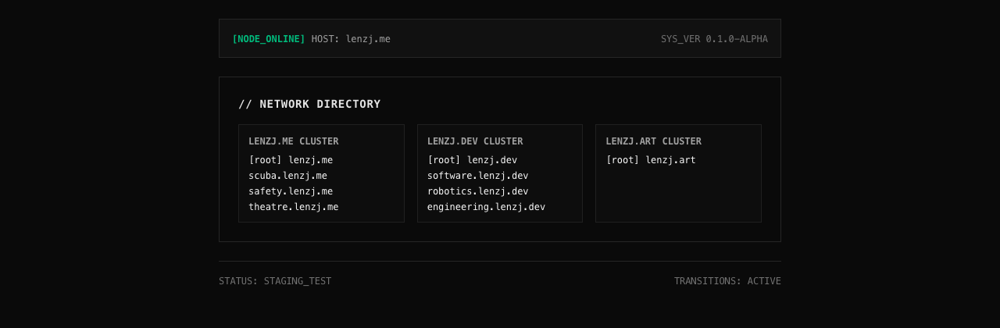

```
██████╗   ██████╗  ██████╗  ████████╗ ███████╗  ██████╗  ██╗      ██╗  ██████╗
██╔══██╗ ██╔═══██╗ ██╔══██╗ ╚══██╔══╝ ██╔════╝ ██╔═══██╗ ██║      ██║ ██╔═══██╗
██████╔╝ ██║   ██║ ██████╔╝    ██║    █████╗   ██║   ██║ ██║      ██║ ██║   ██║
██╔═══╝  ██║   ██║ ██╔══██╗    ██║    ██╔══╝   ██║   ██║ ██║      ██║ ██║   ██║
██║      ╚██████╔╝ ██║  ██║    ██║    ██║      ╚██████╔╝ ███████╗ ██║ ╚██████╔╝
╚═╝       ╚═════╝  ╚═╝  ╚═╝    ╚═╝    ╚═╝       ╚═════╝  ╚══════╝ ╚═╝  ╚═════╝
```

My personal sites, built as one deployable app per subdomain instead of one site with paths.

> [!WARNING]
> This is early. One of the nine sites has real content, the other eight are
> scaffolds that render a heading and a status line. Nothing is deployed yet, so
> every `lenzj.*` URL below points at a domain I haven't pushed to.

<div align="center">


</div>

## About

I'm splitting my personal sites across three domains and nine hosts. Rather than
one site serving `/scuba` and `/theatre`, each one is its own Astro app with its
own build, its own sitemap and its own hostname. They share a single file that
lists every host and every dev port.

That file is the whole trick. `packages/site/sites.js` holds the table, and both
the dev server ports and the production URLs are read from it, so a port can't
drift out of sync with the hostname it belongs to.

- Nine independently deployable sites across `lenzj.me`, `lenzj.dev` and `lenzj.art`
- Hosts and ports written down once, in `packages/site/sites.js`
- `urlFor()` returns a `localhost` port in dev and an `https://` subdomain in production, so cross-site links work in both without an edit
- Each site generates a sitemap scoped to its own origin, because nine origins can't share one
- `lenzj.art` is photography, at the domain root rather than on a subdomain, because that's the practice the name is for
- Static output, no server to run

## Tech stack

| Layer                       | Technology                                    | Why it's here                                                                                                                      |
| --------------------------- | --------------------------------------------- | ---------------------------------------------------------------------------------------------------------------------------------- |
| Package manager and runtime | Bun 1.4                                       | Installs the workspace and runs the scripts. Its isolated installs give each app only what it declares.                            |
| Task runner                 | Turborepo 2.10                                | Builds nine apps in one command and caches the ones that didn't change.                                                            |
| Framework                   | Astro 7                                       | Static HTML per site with no client JavaScript shipped by default.                                                                 |
| Styling                     | Tailwind CSS 4                                | Loaded through `@tailwindcss/vite`. The old `@astrojs/tailwind` integration is deprecated and its peers stop at Astro 5.           |
| Sitemaps                    | `@astrojs/sitemap` 3.7                        | One sitemap per site, built from the `site` URL that `defineSite()` sets.                                                          |
| Database                    | MongoDB                                       | Where anything dynamic goes when I add it. Nothing uses one today, so there's no driver installed and no connection string to set. |
| Language                    | JavaScript, ESM                               | No TypeScript here. The config files are `.mjs`, everything else is `.js` or `.astro`.                                             |
| Linting                     | ESLint 9 with `eslint-plugin-astro` 1.7       | Version 1 is the last line that doesn't require the typescript-eslint packages as peers.                                           |
| Formatting                  | Prettier 3.9 with `prettier-plugin-astro` 1.0 | Without the plugin, Prettier skips `.astro` files.                                                                                 |
| Bundler                     | Vite, via Astro                               | Where the Tailwind plugin attaches.                                                                                                |
| Deploys                     | Wrangler 4 on GitHub Actions                  | Builds once, ships every site from the same commit.                                                                                |

## Screenshots



The root site at `lenzj.me`. Every hostname in those three columns comes from
the registry, and this is a production build, which is why they read as
`scuba.lenzj.me` rather than `localhost:3002`. Run `bun run dev` and the same
markup renders the localhost ports instead.


What the other eight look like today. The title and the description come from
the registry row, and the link at the top right resolves to whichever cluster
root the site belongs to.

## Getting started

### Prerequisites

- **Bun 1.2 or later.** I'm on 1.4.2.
- **Node 22.12 or later.** Bun runs the scripts, but Astro's CLI starts with `#!/usr/bin/env node`, so Node executes the actual build, and Astro 7 refuses anything below 22.12.0. There's a `.node-version` file, so most CI picks this up on its own.

### Installation

```sh
git clone https://github.com/saturncity/portfolio.git
cd portfolio
bun install
```

### Running

```sh
bun run dev
```

That starts all nine dev servers at once. The root site comes up on
<http://localhost:3001>, and the ports run through to 3009 in the order listed
in the registry. To work on one site on its own:

```sh
bun run dev --filter=@lenzj/scuba
```

### Building

```sh
bun run build
```

Each site writes to its own `apps/<name>/dist`. There are no environment
variables to set.

### Checks

```sh
bun run lint
bun run format:check
```

There's no test suite. For nine static pages I didn't think one earned its keep.

## Project structure

```
.
├── apps/                   one Astro app per host, nine of them
│   ├── me/                 lenzj.me, the directory page, the only real content
│   ├── scuba/              scuba.lenzj.me
│   ├── safety/             safety.lenzj.me
│   ├── theatre/            theatre.lenzj.me
│   ├── dev/                lenzj.dev
│   ├── software/           software.lenzj.dev
│   ├── robotics/           robotics.lenzj.dev
│   ├── engineering/        engineering.lenzj.dev
│   └── photography/        lenzj.art, the root of the domain, not a subdomain
├── packages/
│   └── site/               shared across every app
│       ├── sites.js        the registry: hosts, ports, clusters, titles
│       ├── config.js       defineSite(), builds each app's Astro config
│       └── global.css      one line, imports Tailwind
├── docs/assets/            README screenshots
├── eslint.config.js
└── turbo.json
```

Each app holds three files: a `package.json`, an `astro.config.mjs` that's a
one-line call to `defineSite()`, and a page.

## Known issues

**Cross-site view transitions don't fire.** `apps/me/src/pages/index.astro` sets
`<meta name="view-transition" content="same-origin">`, and the footer claims
`TRANSITIONS: ACTIVE`. Cross-document view transitions only run between
same-origin documents, and `lenzj.me` to `scuba.lenzj.me` crosses origins, so
nothing animates. It's the cost of picking subdomains over paths. I need to
either drop the meta tag and fix the footer, or accept plain navigation between
sites.

**Eight of nine sites are empty.** They render a title, a one-line description
and the word `SCAFFOLD`. I'll fill them in one at a time.

**Nothing is live yet.** The pipeline exists, but the Cloudflare projects, the
secrets and the domain bindings are still to do. See Deploying below.

**No shared layout.** All nine pages repeat the same HTML shell. That's fine for
nine near-identical scaffolds and it'll stop being fine as soon as two of them
have real content, at which point the chrome moves into `packages/site`.

## Deploying

Every push to `main` runs `.github/workflows/deploy.yml`. One job installs, lints,
format-checks and builds the whole workspace, then ships each site to its own
Cloudflare Pages project with Wrangler.

It's one job rather than a matrix on purpose. The checks gate the deploy, so a
broken build ships nothing instead of shipping four sites and failing on the rest.

`scripts/deploy-targets.mjs` reads the registry and prints what to ship, so the
workflow holds no list of its own. A site with `deploy: false` never reaches CI,
which is how `lenzj.art` keeps serving the Adobe Portfolio site that's already
there.

### One-time setup

There's a wizard for the rest of it. It checks your logins, walks you through
creating the API token, writes both GitHub secrets, points the eight custom
domains at their projects, talks you through the `lenzj.com` redirect, then
triggers a real CI run so you can see the pipeline work:

```sh
./scripts/setup-cloudflare.sh
```

It's safe to stop with Ctrl-C and re-run. Anything it couldn't do is listed at
the end as an explicit manual step. The API token is never written to disk, so
a re-run asks for it again.

The Pages projects themselves already exist. If you ever need to recreate them:

```sh
bunx wrangler login
node scripts/deploy-targets.mjs | while read -r key project; do
  bunx wrangler pages project create "$project" --production-branch main --force
done
```

`--force` is load-bearing. Without it, wrangler delegates project creation to the
newer Workers-based Pages, which tries to reconfigure the app by running
`astro add cloudflare` through npm. npm doesn't understand bun's `workspace:*`
protocol, so it dies on `@lenzj/site` and creates nothing. `--force` creates the
project directly and is only needed this once. `wrangler pages deploy`, which is
what CI runs, needs no flag.

Add two repository secrets under Settings, Secrets and variables, Actions:

| Secret                  | Where it comes from                                                                       |
| ----------------------- | ----------------------------------------------------------------------------------------- |
| `CLOUDFLARE_API_TOKEN`  | Cloudflare dashboard, My Profile, API Tokens. Needs the Cloudflare Pages edit permission. |
| `CLOUDFLARE_ACCOUNT_ID` | Cloudflare dashboard sidebar, or `bunx wrangler whoami`.                                  |

Then bind each custom domain to its project in the Pages dashboard. All four
domains already use Cloudflare nameservers, so that's a dropdown rather than a
DNS edit.

`lenzj.com` redirects to `lenzj.me` through a Cloudflare Redirect Rule on the
`lenzj.com` zone. Nothing in this repo configures it and it isn't set up yet.

## Contributing

This is my personal site, so I'm not looking for feature work. If you spot
something broken, open an issue.

The code is readable but it isn't reusable. See the license below before you
copy anything out of it.

## License

Copyright 2026 Jason Aaren Lenz, all rights reserved. See [LICENSE](LICENSE).

You can read the code and clone it to read it. You can't use, copy, modify or
redistribute any of it, and it isn't available as training data for machine
learning models. If you want to do something with it, ask me first.
